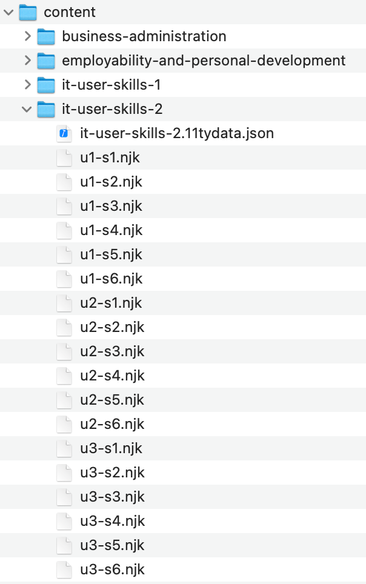

Having content in the `site/_data/courses` folder will not build a course automatically. In order to do this, we need to create _template_ files in the `site/content` folder. Template files are what tell the system what to build.

## File / Folder Structure

Inside the `content` folder, you should create a new folder named after your new course. All template files are placed inside this folder along with a special data file. The data file has a very specific naming convention - `[folder-name].11tydata.json`. If the file is not named correctly then the course build will fail.

### Template Files

The template files are fairly simple and each one corresponds to an individual session in a unit. For example, the template file for Unit 1 Session 1 of your course would be named `u1-s1.njk`, and Unit 3 Session 4 would be `u3-s4.njk`, for example.

#### Example Template File
```liquid
---
unit: 1
session: 1
pagination:
  data: courses['it-user-skills-level-2']['01-word-processing-software']['01-welcome']
  size: 1
  alias: module
  resolve: values
  addAllPagesToCollections: true
---

<!-- {{ module.data.title }} -->
```

Template files the system where to find your course content (`.yaml`) files. The only keys you need to change in a template file
are:

- `unit:` Change this value to the required unit number
- `session:` Change this value to the required session nummber
- `data:` This corresponds to the folders in the `_data/courses` folder where the `.yaml` files for the required session are, e.g. `['course-folder-name']['unit-folder-name']['session-folder-name']`

This image shows how the `content` folder looks for the IT User Skills Level 2 course. Note there is a template (`.njk`) file for every session in a unit and a corresponding data file whose name matches the parent folder name, e.g `it-user-skills-2.11tydata.json`. The content of the data file is discussed on the [next page]().


