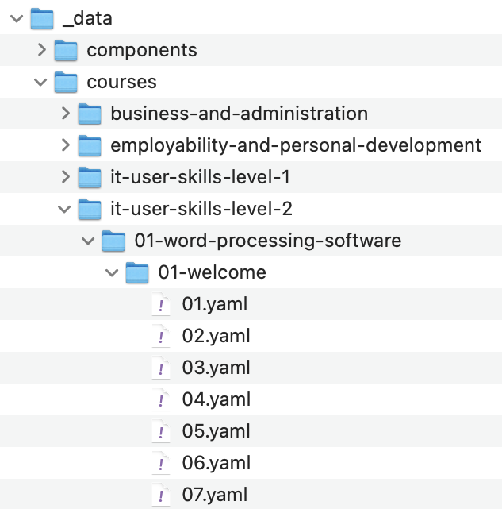

## Course Content

All course content is found in the `site/_data/courses` folder. It must be created using the following naming conventions:

### Naming Conventions

- Use lowercase for folder and file names
- Use hyphens `-` to separate words. Do not use spaces.
- Folders should be named according to their corresponding Unit/Session name.
- Folder names should begin with the Unit/Session number, including a leading zero, e.g. `01-unit-name`.
- Page content data files should be named according to their page number in the session, including a leading zero, e.g. `01.yaml`

If we take the IT User Skills Level 2 course as an example, these rules map to:
	
	it-user-skills-level-2/01-word-processing-software/01-welcome/01.yaml

**NOTE: The folder structure and naming conventions generate the content in the page header and navigation so if you're experiencing issues, double check everything is in order here.**

## Pages

Pages are written in `YAML` format, a structured data format designed to be human-readable. It is a list of key/value pairs which instruct the system what to display on each page. The `keys` tell the page templates what type of data they are about to receive and the `values` are the actual content to be rendered. This is covered in more detail in [Page Basics](/page-basics).
