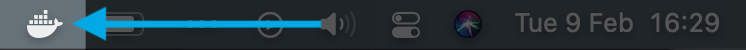
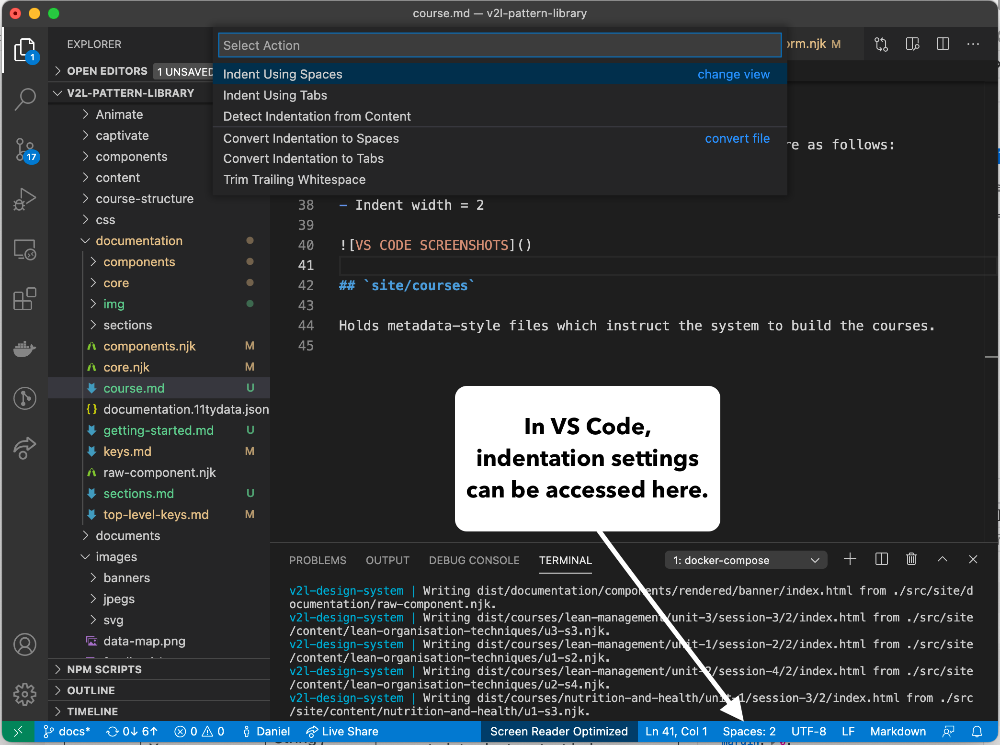

## Prerequisites

- A [GitHub account](https://github.com/join)
- Download the [{{ site.v2l | safe }} Design System source code](https://github.com/MrSleeth/v2l-pattern-library)
- [Install Docker](https://www.docker.com/get-started) 
- Install a good text editor, [Visual Studio Code](https://code.visualstudio.com/) is recommended but any code/text editor, such as [Atom](https://atom.io/), will work

Once you've downloaded and installed the prerequisites, you are ready to run the {{ site.v2l | safe }} Design System on your local machine. 

## Starting up the Design System

First, ensure Docker is running by looking for the Docker icon – it looks like a whale – in the Menu Bar (top right, macOS) or the System Tray (bottom right, Windows). If not, start Docker from the `Applications` folder in macOS or via the Start Menu on Windows. Depending on the speed of your system, it may take a few minutes for Docker to fully start up.

### The Docker Icon on macOS


### From Visual Studio Code

 - Open the source code folder: `File > Open...`
 - Open a Terminal from within VS Code: `Terminal > New Terminal` from the Menu Bar

 VS Code's integrated Terminal will automatically open into the source code folder.

### From Terminal/Command Prompt

Open Terminal (`Applications > Utilities`, macOS) or Command Prompt (`Start > type cmd`, Windows) and navigate to the location of the source code downloaded from GitHub.

```bash
cd /path/to/folder
```

e.g.

```bash
cd /Users/dan/Sites/v2l-pattern-library
```

### Start Up Command

Once you've got a Terminal up and running and pointing to the correct folder, type:

```bash
docker-compose up
```

This will start the system up which will be accessible via a web browser at [localhost:8080](http://localhost:8080).

The system will watch for changes to files and automatically rebuild the site and reload your browser with the changes.

When everything is ready, you should see something similar to the below in your Terminal:

```shell
v2l-design-system | Watching…
v2l-design-system | [Browsersync] Access URLs:
v2l-design-system |  -----------------------------------
v2l-design-system |        Local: http://localhost:8080
v2l-design-system |     External: http://172.19.0.2:8080
v2l-design-system |  -----------------------------------
v2l-design-system |           UI: http://localhost:3001
v2l-design-system |  UI External: http://localhost:3001
v2l-design-system |  -----------------------------------
v2l-design-system | [Browsersync] Serving files from: dist
```

_Note: It may take a while (~10 minutes or more) for the system to start up after running `docker-compose up` for the first time. You might want to make a cuppa..._

## Stopping the System

To stop the system, ensure your Terminal has keyboard focus then press `ctrl c`.

## Editor Settings

Please ensure your text editor's indentation settings are as follows:

- Indent using spaces
- Indent width = 2


